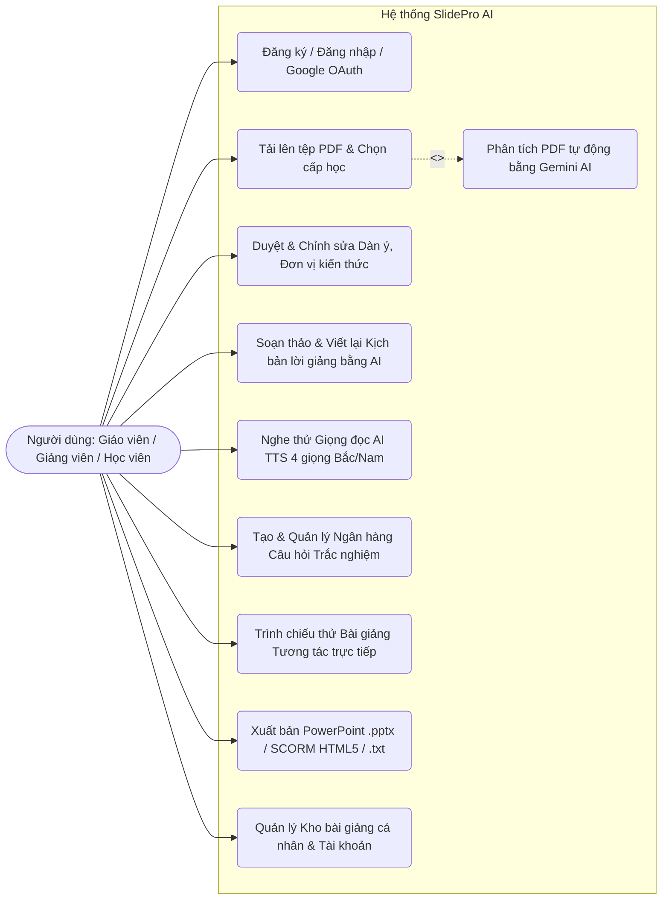
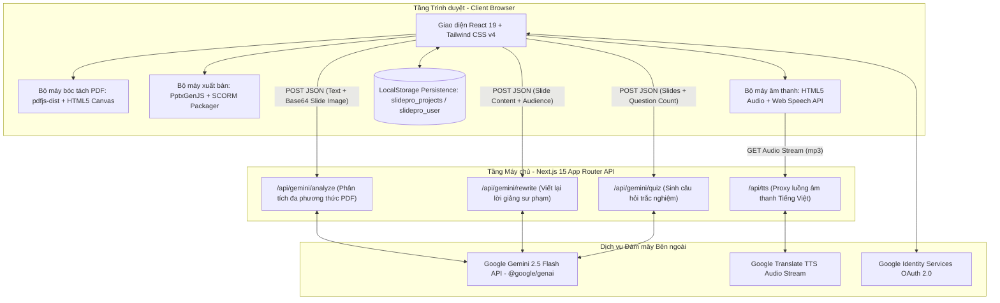
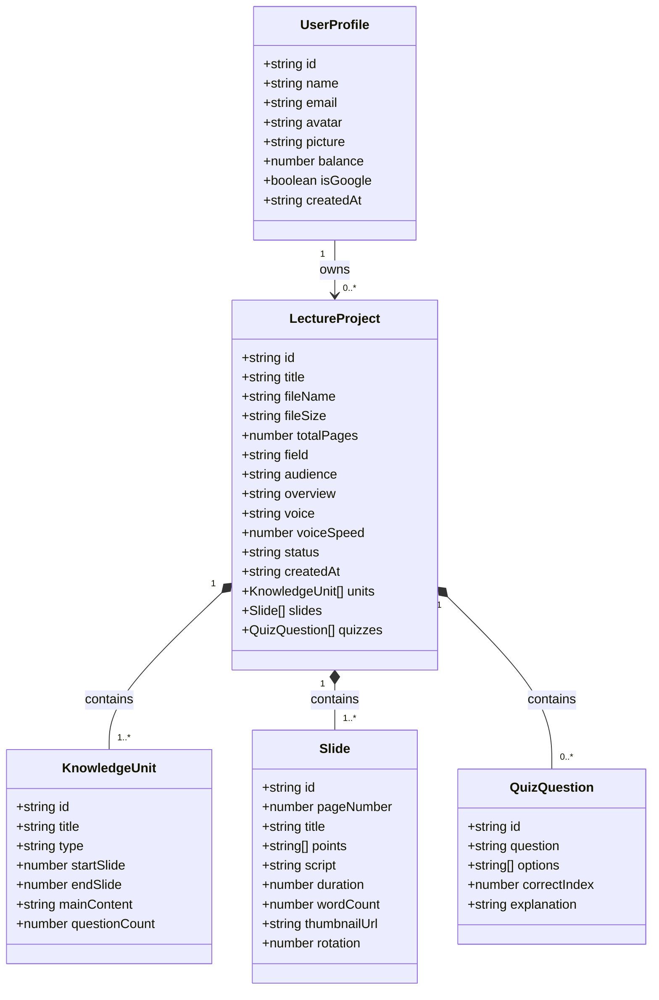

# BÁO CÁO ĐỀ TÀI THỰC TẬP: HỆ THỐNG SLIDEPRO AI (SLIDEEDU)
**Tên đề tài tiếng Việt:** Nghiên cứu và xây dựng nền tảng ứng dụng Trí tuệ nhân tạo (Google Gemini Multimodal) hỗ trợ chuyển đổi tài liệu PDF sang bài giảng điện tử E-Learning, kịch bản thuyết trình đa giọng đọc và ngân hàng câu hỏi trắc nghiệm.  
**Tên đề tài tiếng Anh:** *Research and Development of an AI-Powered Educational Platform (SlidePro AI) for Transforming PDF Documents into Interactive Lectures, Multi-Voice Scripts, and Assessment Quizzes.*

---

## MỤC LỤC
1. [CHƯƠNG 1: TỔNG QUAN ĐỀ TÀI VÀ BÀI TOÁN NGHIỆP VỤ](#chương-1-tổng-quan-đề-tài-và-bài-toán-nghiệp-vụ)
2. [CHƯƠNG 2: PHÂN TÍCH NGHIỆP VỤ VÀ ĐẶC TẢ YÊU CẦU HỆ THỐNG](#chương-2-phân-tích-nghiệp-vụ-và-đặc-tả-yêu-cầu-hệ-thống)
3. [CHƯƠNG 3: KIẾN TRÚC HỆ THỐNG VÀ CÔNG NGHỆ SỬ DỤNG](#chương-3-kiến-trúc-hệ-thống-và-công-nghệ-sử-dụng)
4. [CHƯƠNG 4: PHÂN TÍCH VÀ THIẾT KẾ CHI TIẾT CÁC PHÂN HỆ CHỨC NĂNG](#chương-4-phân-tích-và-thiết-kế-chi-tiết-các-phân-hệ-chức-năng)
5. [CHƯƠNG 5: THIẾT KẾ CẤU TRÚC DỮ LIỆU VÀ ĐẶC TẢ API](#chương-5-thiết-kế-cấu-trúc-dữ-liệu-và-đặc-tả-api)
6. [CHƯƠNG 6: KỊCH BẢN KIỂM THỬ, KẾT QUẢ ĐẠT ĐƯỢC VÀ HƯỚNG PHÁT TRIỂN](#chương-6-kịch-bản-kiểm-thử-kết-quả-đạt-được-và-hướng-phát-triển)

---

## CHƯƠNG 1: TỔNG QUAN ĐỀ TÀI VÀ BÀI TOÁN NGHIỆP VỤ

### 1.1. Bối cảnh thực tiễn và Lý do chọn đề tài
Trong bối cảnh chuyển đổi số ngành Giáo dục và Đào tạo doanh nghiệp (E-Learning, Blended Learning, Flipped Classroom), giảng viên và chuyên viên đào tạo thường sở hữu nguồn học liệu đồ sộ dưới định dạng **tệp PDF** (slide bài giảng xuất từ PowerPoint/Keynote/Canva, giáo trình điện tử, tài liệu chuyên khảo). Tuy nhiên, để chuyển hóa một tệp PDF tĩnh thành một **bài giảng điện tử hoàn chỉnh** phục vụ giảng dạy trực tuyến hoặc tự học trên hệ thống LMS (Learning Management System), người dạy phải thực hiện thủ công nhiều công đoạn tốn thời gian:
1. **Đọc và phân rã cấu trúc bài học** thành các phần/chương (Đơn vị kiến thức - Knowledge Units).
2. **Biên soạn kịch bản lời giảng (Speaker Notes / Voiceover Script)** chi tiết cho từng trang slide sao cho phù hợp với trình độ nhận thức của đối tượng người học (Tiểu học, THCS, THPT, Đại học hay Người đi làm).
3. **Thu âm giọng giảng hoặc tạo giọng đọc AI (Text-to-Speech - TTS)** khớp với nhịp độ từng trang slide.
4. **Xây dựng bộ câu hỏi trắc nghiệm (Quiz)** kèm đáp án và giải thích chi tiết bám sát nội dung bài học để đánh giá mức độ tiếp thu của học viên.
5. **Đóng gói sang các chuẩn xuất bản** như tệp trình chiếu PowerPoint (`.pptx`) có nhúng sẵn ghi chú diễn giả hoặc gói chuẩn E-Learning (`SCORM / HTML5`) để tích hợp lên LMS.

Mặt khác, thách thức lớn nhất khi ứng dụng các mô hình ngôn ngữ lớn (LLM) thông thường vào giáo dục là **hiện tượng ảo giác (AI Hallucination)** — AI tự ý thêm bớt, suy diễn hoặc làm sai lệch các số liệu, công thức, định nghĩa chuyên ngành có trong tài liệu gốc của giáo viên.

Xuất phát từ thực tế đó, đề tài **"Xây dựng hệ thống SlidePro AI (SlideEdu)"** được thực hiện nhằm tự động hóa toàn diện quy trình chuyển đổi tài liệu PDF sang bài giảng thông minh theo quy trình 4 bước chuẩn hóa, đồng thời áp dụng **cơ chế kiểm soát AI nghiêm ngặt (Strict Verbatim & Grounded Pedagogical Processing)** để bảo toàn tuyệt đối 100% tính chính xác của học liệu gốc.

---

### 1.2. Mục tiêu của đề tài
- **Mục tiêu tổng quát:** Xây dựng một ứng dụng Web hoàn chỉnh, hiện đại, hỗ trợ giáo viên, giảng viên và học sinh/sinh viên chuyển đổi nhanh tệp slide bài giảng PDF thành bộ học liệu đa phương tiện gồm: Dàn ý bài giảng, Kịch bản lời giảng theo cấp học, Giọng đọc AI tiếng Việt tự nhiên (Bắc - Nam), Ngân hàng câu hỏi trắc nghiệm và Gói xuất bản `.pptx` / `SCORM HTML5`.
- **Mục tiêu cụ thể:**
  1. **Trích xuất PDF đa phương thức (Multimodal PDF Parsing):** Bóc tách chính xác văn bản theo tọa độ dòng (X/Y) và kết xuất hình ảnh trực quan từng trang slide ngay trên trình duyệt.
  2. **Kiểm soát chất lượng AI nghiêm ngặt (Zero-Hallucination):** Đảm bảo AI không tự ý thay đổi, bịa đặt hay sửa đổi kiến thức, số liệu trong PDF gốc; mọi lời giảng và câu hỏi trắc nghiệm đều phải truy xuất nguồn gốc trực tiếp từ trang slide tương ứng.
  3. **Cá nhân hóa văn phong sư phạm theo 6 đối tượng người học:** Tự động điều chỉnh ngữ điệu, cách xưng hô và độ sâu giải thích cho Học sinh Tiểu học, THCS, THPT, Sinh viên Đại học, Người đi làm và Đại chúng.
  4. **Tổng hợp giọng nói Tiếng Việt đa vùng miền (Multi-Voice TTS):** Cung cấp 4 cấu hình giọng đọc Nam/Nữ miền Bắc (Hà Nội) và miền Nam (TP.HCM) với cơ chế phát trực tiếp và dự phòng đa tầng.
  5. **Đa dạng hóa đầu ra (Multi-Format Export):** Hỗ trợ xuất trực tiếp tệp PowerPoint (`.pptx`) 16:9 nhúng Speaker Notes, gói học liệu tương tác `SCORM 1.2 / HTML5` và văn bản kịch bản (`.txt`).

---

### 1.3. Đối tượng sử dụng hệ thống (Actors)
| STT | Nhóm người dùng | Nhu cầu & Mục đích sử dụng chính |
| :--- | :--- | :--- |
| 1 | **Giáo viên phổ thông (Tiểu học, THCS, THPT)** | Chuyển đổi slide PDF bài học hàng ngày thành kịch bản lời giảng sinh động phù hợp tâm lý lứa tuổi, tạo nhanh câu hỏi củng cố cuối bài và xuất PowerPoint có sẵn lời dẫn. |
| 2 | **Giảng viên Đại học / Cao đẳng** | Xử lý các bài giảng học thuật chuyên sâu (Y khoa, Kỹ thuật, CNTT, Kinh tế...), đảm bảo giữ nguyên 100% thuật ngữ và số liệu lâm sàng/khoa học, xuất gói SCORM đưa lên hệ thống LMS của trường. |
| 3 | **Chuyên viên Đào tạo nội bộ (L&D / Corporate Trainer)** | Chuyển đổi tài liệu quy trình nghiệp vụ, hướng dẫn sản phẩm (PDF) thành bài giảng E-Learning tự học có giọng đọc AI và bài kiểm tra trắc nghiệm cho nhân sự mới. |
| 4 | **Học sinh / Sinh viên** | Tải slide bài giảng của thầy cô lên hệ thống để nghe giảng lại bằng giọng đọc AI và tự luyện tập thông qua hệ thống câu hỏi Quiz trắc nghiệm trích xuất từ từng trang slide. |

---

## CHƯƠNG 2: PHÂN TÍCH NGHIỆP VỤ VÀ ĐẶC TẢ YÊU CẦU HỆ THỐNG

### 2.1. Quy trình nghiệp vụ tổng thể (End-to-End Business Workflow)
Nghiệp vụ lõi của hệ thống **SlidePro AI** được thiết kế theo mô hình đường ống 4 bước tuần tự (4-Step Wizard Pipeline) kết hợp với 2 cổng xác nhận kiểm duyệt chất lượng (Quality Gate Confirmation Modals):

```mermaid
flowchart TD
    Start([Người dùng truy cập SlidePro AI]) --> AuthCheck{Đã đăng nhập?}
    AuthCheck -- Chưa --> AuthModal[Đăng nhập / Đăng ký hoặc Google OAuth 2.0]
    AuthModal --> Step1
    AuthCheck -- Rồi --> Step1

    subgraph BƯỚC 1: TẢI LÊN & CẤU HÌNH ĐẦU VÀO
        Step1[Chọn tệp PDF bài giảng hoặc Bài giảng mẫu] --> ParsePDF[Trích xuất văn bản theo dòng & Render ảnh từng trang Slide bằng PDF.js]
        ParsePDF --> SelectAudience[Chọn Cấp học / Đối tượng người học mục tiêu]
        SelectAudience --> BatchAI[Xử lý AI đa phương thức theo từng cụm Slide qua Gemini 2.5 Flash]
    end

    BatchAI --> Step2

    subgraph BƯỚC 2: DUYỆT DÀN Ý & ĐƠN VỊ KIẾN THỨC
        Step2[Xem thông tin chung, chỉnh sửa Tiêu đề, Lĩnh vực, Đối tượng, Tổng quan] --> ManageUnits[Quản lý các Phần / Đơn vị kiến thức: Lý thuyết / Thực hành, phạm vi Slide, số câu hỏi]
        ManageUnits --> PreviewSlides[Xem trước hình ảnh từng Slide, xoay trang 90 độ, phóng to]
    end

    PreviewSlides --> Gate1{Cổng xác nhận 1: Xác nhận Dàn ý & Giọng đọc}
    Gate1 -- Chỉnh sửa lại --> Step2
    Gate1 -- Xác nhận --> Step3

    subgraph BƯỚC 3: SOẠN LỜI GIẢNG, GIỌNG ĐỌC TTS & CÂU HỎI QUIZ
        Step3[Tab 1: Quản lý Kịch bản Lời giảng từng Slide] --> TTS[Chọn 4 giọng đọc Bắc/Nam, Nghe thử TTS từng Slide]
        Step3 --> AIRewrite[Dùng Gemini AI viết lại lời giảng cho từng Slide hoặc toàn bộ Slide theo cấp học]
        Step3 --> ManualEditScript[Chỉnh sửa trực tiếp lời giảng, tự động tính lại số từ & thời lượng giây]
        Step3 --> QuizTab[Tab 2: Quản lý Ngân hàng Câu hỏi Trắc nghiệm]
        QuizTab --> AIQuiz[Sinh thêm câu hỏi trắc nghiệm bằng AI bám sát nội dung gốc]
        QuizTab --> ManualQuiz[Thêm/Sửa/Xóa câu hỏi, chọn đáp án đúng A/B/C/D & giải thích]
    end

    ManualEditScript --> LivePreview[Trình chiếu thử bài giảng tương tác toàn màn hình: Slide + Audio + Phụ đề + Quiz]
    ManualQuiz --> Gate2{Cổng xác nhận 2: Kiểm tra trước Đóng gói}
    Gate2 -- Quay lại sửa --> Step3
    Gate2 -- Xác nhận hoàn tất --> Step4

    subgraph BƯỚC 4: ĐÓNG GÓI & XUẤT BẢN ĐA ĐỊNH DẠNG
        Step4[Màn hình Hoàn tất & Xuất bản] --> ExportPPTX[Xuất file PowerPoint .pptx 16:9 nhúng ảnh gốc + Speaker Notes + Slide Quiz]
        Step4 --> ExportSCORM[Xuất gói E-Learning chuẩn SCORM 1.2 / HTML5 tương tác]
        Step4 --> ExportTXT[Xuất file văn bản .txt toàn bộ kịch bản lời giảng & câu hỏi]
        Step4 --> SaveLibrary[Lưu trữ tự động vào Kho bài giảng cá nhân]
    end
```

---

### 2.2. Các quy tắc nghiệp vụ cốt lõi (Core Business Rules)

#### Quy tắc 1: Quy tắc Sao chép và Xử lý Tài liệu PDF Tuyệt đối Nghiêm ngặt (Strict Verbatim Rule)
Hệ thống áp dụng bộ quy tắc kiểm soát đầu ra AI ở mức độ nghiêm ngặt cao nhất (với `temperature = 0.1` và `responseSchema` định kiểu chặt chẽ):
1. **Bảo toàn 100% thông tin gốc:** AI không được tự ý thay đổi, bịa đặt, thêm thắt hoặc sửa đổi nội dung, kiến thức, định nghĩa, công thức, số liệu có sẵn trong tệp PDF của slide.
2. **Xử lý đa phương thức (Văn bản + Thị giác máy tính):** Đối với các trang PDF dạng ảnh quét (scanned PDF) hoặc chứa sơ đồ/biểu đồ phức tạp mà lớp văn bản thô bị thiếu, hệ thống gửi đồng thời cả văn bản trích xuất lẫn ảnh chụp trang slide (`inlineData` JPEG Base64) để mô hình Gemini đọc chính xác chữ trên hình ảnh.
3. **Xử lý phân cụm (Batch Processing):** Để tránh giới hạn Token đầu ra khi tệp PDF có nhiều trang (ví dụ 15–50 trang), hệ thống chia nhỏ danh sách slide thành các cụm (batches) gồm 5 trang/lần gọi API, đảm bảo **100% số trang của tệp PDF đều được phân tích chi tiết**, không bỏ sót bất kỳ trang nào.

#### Quy tắc 2: Quy tắc Chuyển thể Kịch bản Giọng đọc theo Cấp học (Persona-Driven Voiceover Script)
Dựa hoàn toàn trên thông tin của từng trang slide gốc, AI chuyển thể các gạch đầu dòng khô khan thành lời giảng tự nhiên, truyền cảm để giáo viên đọc hoặc tổng hợp giọng nói TTS, tùy biến theo 6 hồ sơ người học:
- **Học sinh Tiểu học (Lớp 1 - 5):** Xưng hô *"Cô/Thầy và các con"*, giọng kể chuyện ấm áp, câu ngắn gọn, giải thích trực quan nhưng giữ nguyên 100% kiến thức trên slide.
- **Học sinh THCS (Lớp 6 - 9):** Xưng hô *"Thầy/Cô và các em"*, văn phong khơi gợi sự tò mò khoa học, liên kết logic rõ ràng.
- **Học sinh THPT (Lớp 10 - 12):** Xưng hô *"Thầy/Cô và các em"*, văn phong chuẩn mực, nhấn mạnh các từ khóa trọng tâm và số liệu phục vụ ghi nhớ sâu.
- **Sinh viên Đại học / Cao đẳng:** Xưng hô *"Tôi và các bạn sinh viên"*, văn phong học thuật chuyên nghiệp, giữ nguyên thuật ngữ chuyên ngành.
- **Chuyên viên / Người đi làm:** Xưng hô *"Tôi và các anh/chị đồng nghiệp"*, văn phong súc tích, thực tiễn, đi thẳng vào trọng tâm.
- **Đại chúng (Mọi lứa tuổi):** Văn phong truyền cảm hứng, mạch lạc, dễ tiếp cận.

#### Quy tắc 3: Quy tắc Ước lượng Thời lượng Giảng dạy Sư phạm (Pedagogical Duration Formula)
Mỗi khi kịch bản lời giảng của một slide được tạo mới hoặc chỉnh sửa, hệ thống tự động tính toán số từ (`wordCount`) và thời lượng đọc ước tính (`duration` tính bằng giây) theo tốc độ giảng bài chuẩn của giáo viên Việt Nam (**140 từ/phút**):
$$\text{wordCount} = \text{Số lượng từ trong kịch bản (tách theo khoảng trắng)}$$
$$\text{duration (giây)} = \max\left(20, \text{round}\left(\frac{\text{wordCount}}{140} \times 60\right)\right)$$

#### Quy tắc 4: Quy tắc Sinh Câu hỏi Trắc nghiệm Nội suy trong Slide (Slide-Grounded Quiz Rule)
- Mỗi câu hỏi trắc nghiệm bao gồm 4 phương án lựa chọn (`A, B, C, D`), 1 chỉ mục đáp án đúng (`correctIndex` từ `0` đến `3`) và lời giải thích ngắn gọn (`explanation`).
- **Ràng buộc bắt buộc:** Câu hỏi, đáp án đúng và giải thích chỉ được phép sử dụng kiến thức xuất hiện trực tiếp trong slide bài giảng đó. Các phương án nhiễu (distractors) phải hợp lý về mặt ngữ pháp nhưng sai lệch so với thông tin trên slide, tuyệt đối không sử dụng kiến thức ngoài tài liệu.

---

### 2.3. Sơ đồ Use Case Tổng quát



---

### 2.4. Đặc tả Yêu cầu Phi chức năng (Non-Functional Requirements)
1. **Tính chính xác & Tin cậy (Accuracy & Reliability):**
   - Đảm bảo hệ thống luôn hoạt động ổn định ngay cả khi mất kết nối mạng tạm thời hoặc hạn mức API bị giới hạn nhờ cơ chế **Multi-tier Fallback** (tự động chuyển về trích xuất nguyên bản từ dữ liệu PDF cục bộ nếu kết nối AI gặp sự cố).
2. **Hiệu năng xử lý (Performance):**
   - Tác vụ phân tách tệp PDF và kết xuất ảnh thu nhỏ (Thumbnails) được thực hiện trực tiếp tại trình duyệt (Client-side Web Worker qua `pdfjs-dist`), giảm tải băng thông truyền tệp nhị phân lớn lên máy chủ.
   - Tự động nén ảnh chụp slide (`JPEG quality 0.72` khi phân tích và `0.35` khi lưu trữ vào `localStorage`) giúp ứng dụng lưu được nhiều dự án mà không vượt quá giới hạn bộ nhớ trình duyệt (5MB Quota).
3. **Giao diện & Trải nghiệm người dùng (UI/UX & Accessibility):**
   - Hỗ trợ chuyển đổi mượt mà giữa **Giao diện Sáng (Light Mode)** và **Giao diện Tối (Dark Mode)** trên toàn bộ màn hình.
   - Thiết kế đáp ứng (**Responsive Design**): Hoạt động tối ưu trên cả máy tính để bàn (Sidebar cố định bên trái) và thiết bị di động/máy tính bảng (Thanh điều hướng Bottom Navigation Bar).
4. **Bảo mật (Security):**
   - Khóa `GEMINI_API_KEY` được bảo vệ nghiêm ngặt ở tầng Server-side (Next.js Route Handlers), tuyệt đối không lộ ra mã nguồn phía trình duyệt của người dùng.

---

## CHƯƠNG 3: KIẾN TRÚC HỆ THỐNG VÀ CÔNG NGHỆ SỬ DỤNG

### 3.1. Kiến trúc tổng thể hệ thống
Hệ thống được xây dựng theo kiến trúc **Full-stack Web hiện đại trên nền tảng Next.js 15 (App Router)**, kết hợp giữa sức mạnh tính toán phía Client (PDF Rendering, PPTX Generation, Web Speech Synthesis, Local Persistence) và các dịch vụ AI/TTS phía Server (Serverless API Routes).



---

### 3.2. Danh mục Công nghệ sử dụng (Tech Stack)

| Tầng công nghệ | Thư viện / Công cụ | Phiên bản | Vai trò trong hệ thống |
| :--- | :--- | :--- | :--- |
| **Core Framework** | **Next.js (App Router)** | `15.4.11` | Framework chủ đạo cung cấp cơ chế định tuyến, Server/Client Components và API Route Handlers. |
| **UI Library** | **React & React DOM** | `19.0.0` | Xây dựng giao diện người dùng hướng thành phần (Component-based), quản lý trạng thái tương tác thời gian thực. |
| **Ngôn ngữ lập trình** | **TypeScript** | `5.9.3` | Kiểm soát kiểu dữ liệu tĩnh chặt chẽ cho toàn bộ mô hình bài giảng, slide, câu hỏi và giao tiếp API. |
| **Styling & Animation** | **Tailwind CSS v4 & Motion** | `4.1.11` | Thiết kế giao diện đáp ứng (Responsive), hỗ trợ Dark/Light theme và hiệu ứng chuyển cảnh mượt mà. |
| **Hệ thống Biểu tượng** | **Lucide React** | `0.542.0` | Cung cấp bộ icon trực quan cho các công cụ giáo dục, trình phát âm thanh và điều hướng. |
| **Trí tuệ nhân tạo (AI)** | **Google GenAI SDK (`@google/genai`)** | `1.17.0` | Tích hợp mô hình đa phương thức **Gemini 2.5 Flash** hỗ trợ Structured JSON Output và Vision. |
| **Xử lý tệp PDF** | **Mozilla PDF.js (`pdfjs-dist`)** | `3.11.174` | Trích xuất văn bản theo tọa độ dòng (X/Y) và kết xuất từng trang PDF thành hình ảnh chất lượng cao. |
| **Xuất bản PowerPoint** | **PptxGenJS (`pptxgenjs`)** | `4.0.1` | Khởi tạo tệp trình chiếu `.pptx` chuẩn 16:9, nhúng ảnh slide gốc, trang bìa, trang Quiz và Speaker Notes. |

---

### 3.3. Cấu trúc thư mục mã nguồn (Project Directory Structure)
```text
SlidePro/
├── app/                                # Thư mục định tuyến Next.js 15 App Router
│   ├── api/                            # Hệ thống Backend API Routes
│   │   ├── gemini/
│   │   │   ├── analyze/route.ts        # API phân tích PDF đa phương thức (Text + Image)
│   │   │   ├── rewrite/route.ts        # API viết lại kịch bản lời giảng theo cấp học
│   │   │   └── quiz/route.ts           # API tự động tạo bộ câu hỏi trắc nghiệm từ slide
│   │   └── tts/route.ts                # API Proxy tổng hợp giọng đọc Tiếng Việt (MP3 Stream)
│   ├── auth/
│   │   └── google/page.tsx             # Trang xử lý luồng xác thực Google OAuth 2.0 Popup
│   ├── globals.css                     # Cấu hình CSS toàn cục và biến giao diện Sáng/Tối
│   ├── layout.tsx                      # Root Layout cấu hình Metadata, Font chữ & Theme
│   └── page.tsx                        # Trang điều phối trung tâm (State Management & Navigation)
├── components/                         # Các thành phần giao diện chức năng (UI Modules)
│   ├── Header.tsx                      # Thanh điều hướng trên cùng (Chuyển đổi Theme, Thông tin User, Tạo mới)
│   ├── Sidebar.tsx                     # Thanh menu bên trái (Soạn bài, Kho bài giảng, Nhật ký, Tài khoản)
│   ├── Stepper.tsx                     # Thanh tiến trình 4 bước (Tải PDF -> Dàn ý -> Lời giảng/Quiz -> Đóng gói)
│   ├── Step1Upload.tsx                 # Phân hệ Bước 1: Tải lên PDF, chọn Cấp học & Kích hoạt xử lý AI
│   ├── Step2Outline.tsx                # Phân hệ Bước 2: Duyệt dàn ý, Quản lý phần học & Xem trước Slide
│   ├── Step3ScriptQuiz.tsx             # Phân hệ Bước 3: Soạn lời giảng AI, Nghe TTS 4 giọng & Quản lý Quiz
│   ├── Step4Export.tsx                 # Phân hệ Bước 4: Đóng gói & Xuất bản (.pptx, SCORM HTML5, .txt)
│   ├── ConfirmModal.tsx                # Hộp thoại xác nhận chuyển bước (Cổng kiểm duyệt 1 & 2)
│   ├── SlidePreviewModal.tsx           # Trình phát bài giảng tương tác trực tiếp (Live Player + Quiz)
│   ├── LibraryModal.tsx                # Giao diện Quản lý Kho bài giảng cá nhân
│   ├── AccountView.tsx                 # Giao diện Quản lý Hồ sơ tài khoản & Nhật ký hoạt động
│   ├── AuthModal.tsx                   # Hộp thoại Đăng nhập / Đăng ký & Tích hợp Google OAuth
│   └── FeedbackModal.tsx               # Hộp thoại Gửi góp ý & Báo lỗi từ người dùng
├── lib/                                # Thư viện xử lý nghiệp vụ lõi (Core Utilities & Services)
│   ├── pdfUtils.ts                     # Thuật toán bóc tách văn bản PDF theo dòng & chụp ảnh Slide
│   ├── ttsService.ts                   # Dịch vụ tổng hợp giọng nói đa tầng (4 giọng Bắc/Nam)
│   ├── exportPptx.ts                   # Bộ máy dựng và xuất tệp PowerPoint (.pptx)
│   ├── storageUtils.ts                 # Cơ chế nén ảnh và quản lý lưu trữ an toàn trên LocalStorage
│   ├── sampleData.ts                   # Dữ liệu bài giảng mẫu (Y khoa & Công nghệ AI) và danh mục cấu hình
│   └── utils.ts                        # Các hàm tiện ích dùng chung
├── types/
│   └── presentation.ts                 # Định nghĩa toàn bộ Interface TypeScript của hệ thống
├── package.json                        # Khai báo thư viện phụ thuộc và kịch bản thực thi
└── tsconfig.json                       # Cấu hình trình biên dịch TypeScript
```

---

## CHƯƠNG 4: PHÂN TÍCH VÀ THIẾT KẾ CHI TIẾT CÁC PHÂN HỆ CHỨC NĂNG

### 4.1. Phân hệ Xác thực và Quản lý Người dùng (`AuthModal.tsx`, `app/auth/google/page.tsx`)
1. **Mô tả chức năng:**
   - Cho phép người dùng đăng ký tài khoản mới, đăng nhập bằng Email/Mật khẩu hoặc đăng nhập nhanh bằng tài khoản Google (**Google OAuth 2.0**).
   - Cung cấp gói tài khoản **Miễn phí trọn đời** ngay khi kích hoạt, giúp giáo viên và sinh viên sử dụng toàn bộ tính năng không giới hạn.
2. **Luồng xử lý kỹ thuật:**
   - Khi người dùng chọn *"Tiếp tục với Google"*, hệ thống mở cửa sổ Popup tới `/auth/google` hoặc kết nối trực tiếp với Google Identity Services (`oauth2/v2/userinfo` với Access Token) để lấy thông tin thực tế (`name`, `email`, `picture`).
   - Dữ liệu phiên đăng nhập được lưu trữ vào `localStorage` (`slidepro_user`) và đồng bộ tức thời với `Header` cũng như `Sidebar`.

---

### 4.2. Phân hệ Bước 1: Tải lên Bài giảng PDF & Phân tích AI Đa phương thức (`Step1Upload.tsx`, `lib/pdfUtils.ts`)
1. **Mô tả chức năng:**
   - Hỗ trợ kéo-thả (Drag & Drop) hoặc chọn tệp `.pdf` từ thiết bị (tối đa 100 MB, quy ước chuẩn `1 trang PDF = 1 Slide`).
   - Cung cấp bộ chọn **6 cấp độ người học** (Tiểu học, THCS, THPT, Đại học/Cao đẳng, Người đi làm, Đại chúng) để định hướng văn phong cho AI.
   - Hỗ trợ 2 bài giảng mẫu có sẵn (*"Sinh lý bệnh và chẩn đoán lâm sàng chèn ép tim"* thuộc lĩnh vực Y khoa và *"Kiến trúc Transformer và Ứng dụng LLM"* thuộc lĩnh vực Công nghệ & AI) để người dùng trải nghiệm nhanh chỉ với 1 cú nhấp chuột.
2. **Thuật toán trích xuất PDF giữ nguyên cấu trúc dòng (`lib/pdfUtils.ts`):**
   - Thay vì nối toàn bộ các phần tử văn bản (`textContent.items`) thành một chuỗi phẳng làm mất cấu trúc gạch đầu dòng và bảng biểu, thuật toán trong `pdfUtils.ts` đọc tọa độ không gian 2 chiều (`transform[4]` là trục X, `transform[5]` là trục Y) của từng mảnh văn bản trên trang PDF:
     - Sắp xếp các phần tử từ trên xuống dưới theo trục Y (với ngưỡng dung sai cùng dòng `LINE_TOLERANCE = 4px`), và từ trái sang phải theo trục X.
     - Tự động chèn khoảng trắng thông minh dựa trên khoảng cách ngang (`gap`) giữa các từ trên cùng một dòng.
     - Kết xuất đồng thời từng trang PDF lên thẻ `<canvas>` ở độ phân giải cao (`scale = 1.5`) và xuất thành chuỗi ảnh `data:image/jpeg;base64` để làm ảnh thu nhỏ (Thumbnail) lẫn đầu vào thị giác cho Gemini AI.
3. **Cơ chế xử lý AI theo cụm trang (Batch Processing):**
   - Khi người dùng nhấn **"Bắt đầu xử lý"**, hệ thống chia tổng số trang slide thành các lô 5 trang (`BATCH_SIZE = 5`), hiển thị hộp thoại tiến trình trực quan (`processProgress` từ `15%` đến `100%`) và gửi tuần tự từng lô lên `/api/gemini/analyze`.
   - Kết quả trả về từ các lô được hợp nhất thành đối tượng `LectureProject` hoàn chỉnh trước khi chuyển sang Bước 2.

---

### 4.3. Phân hệ Bước 2: Duyệt Dàn ý, Quản lý Đơn vị Kiến thức & Xem trước Slide (`Step2Outline.tsx`)
1. **Mô tả chức năng:**
   - **Cột trái (Thông tin chung bài giảng):** Cho phép xem và chỉnh sửa Tên bài giảng, Lĩnh vực chuyên môn (AI tự động nhận diện từ nội dung PDF), Đối tượng người học và đoạn Tổng quan nội dung bài giảng.
   - **Cột giữa (Cấu trúc Đơn vị kiến thức - Knowledge Units):**
     - Hiển thị danh sách các Phần/Chương của bài giảng.
     - Cho phép thêm phần mới (`+ Thêm đơn vị kiến thức`), xóa phần, đổi tên phần, phân loại hình thức (**Lý thuyết** hoặc **Thực hành**), cấu hình phạm vi trang slide (`Slide bắt đầu` – `Slide kết thúc`), biên tập nội dung trọng tâm của phần và chỉ định **số lượng câu hỏi trắc nghiệm** cần tạo cho phần đó.
   - **Cột phải (Trình xem trước Slide trực quan):**
     - Hiển thị ảnh chụp thực tế của từng trang slide PDF gốc hoặc chế độ trình bày mô phỏng (Title + Bullet points).
     - Cung cấp công cụ **Xoay chiều trang Slide (`90°`)** cho các trang PDF bị ngược chiều khi quét, **Phóng to toàn màn hình (Lightbox Zoom)** và thanh chọn nhanh trang slide (`1, 2, 3...`).
2. **Cổng kiểm duyệt 1 (`ConfirmModal.tsx` - Chế độ `outline_to_script`):**
   - Trước khi chuyển từ Bước 2 sang Bước 3, hệ thống hiển thị hộp thoại xác nhận tóm tắt số lượng slide, số đơn vị kiến thức, tổng số câu hỏi dự kiến và cho phép người dùng chọn trước giọng đọc AI cũng như tốc độ đọc (`0.75x`, `1x`, `1.25x`).

---

### 4.4. Phân hệ Bước 3: Soạn Kịch bản Lời giảng, Tổng hợp Giọng đọc TTS & Ngân hàng Câu hỏi Quiz (`Step3ScriptQuiz.tsx`)
Phân hệ Bước 3 được chia thành 2 thẻ (Tabs) chuyên biệt cùng thanh công cụ điều khiển giọng đọc và trình chiếu:

#### A. Thanh công cụ Giọng đọc AI (4 Hồ sơ Giọng đọc Bắc - Nam)
Hệ thống tích hợp dịch vụ `lib/ttsService.ts` cung cấp 4 lựa chọn giọng đọc Tiếng Việt rõ ràng:
1. **👩 Nữ - Giọng Bắc (Hà Nội):** Giọng nữ miền Bắc chuẩn mực, truyền cảm (`pitch = 1.05`, `rate = 1.0`).
2. **👩 Nữ - Giọng Nam (TP.HCM):** Giọng nữ miền Nam nhẹ nhàng, ấm áp, thân thiện (`pitch = 1.18`, `rate = 0.96`).
3. **👨 Nam - Giọng Bắc (Hà Nội):** Giọng nam miền Bắc trầm ấm, chững chạc, học thuật (`pitch = 0.82`, `rate = 0.98`).
4. **👨 Nam - Giọng Nam (TP.HCM):** Giọng nam miền Nam tự nhiên, gần gũi, rõ chữ (`pitch = 0.90`, `rate = 0.95`).

**Cơ chế phát âm thanh thông minh (Smart Chunking & Dual-Engine TTS):**
- Do các dịch vụ TTS trực tuyến thường giới hạn độ dài chuỗi ký tự mỗi lần gọi (~180 ký tự), hàm `splitTextIntoChunks()` tự động tách lời giảng dài thành các câu nhỏ theo dấu câu (`. ! ? ; ,`) mà không làm đứt từ.
- Hệ thống phát nối tiếp từng câu qua thẻ `HTMLAudioElement` kết nối tới `/api/tts` (với kỹ thuật điều chỉnh `playbackRate` và `preservesPitch = false` để tái tạo đúng âm sắc Nam/Nữ Bắc - Nam), đồng thời tự động chuyển sang `window.speechSynthesis` của trình duyệt nếu thiết bị ngoại tuyến.

#### B. Tab 1: Quản lý Kịch bản Lời giảng (`activeTab === 'script'`)
- Hiển thị danh sách thẻ tương ứng với từng trang slide (`Slide 1`, `Slide 2`, ...), kèm thời lượng ước tính (`~X giây • Y từ`).
- **Tạo giọng giảng bài (Nghe):** Phát trực tiếp lời giảng của slide đó bằng giọng đọc đang chọn.
- **AI viết lại từng Slide / AI viết lại toàn bộ Slide:** Gửi yêu cầu tới `/api/gemini/rewrite` kèm cấp học mục tiêu để Gemini biên tập lại lời giảng mượt mà, tự nhiên hơn nhưng vẫn giữ nguyên tuyệt đối kiến thức và số liệu gốc trên slide.
- **Hộp thoại Chỉnh sửa lời giảng chuyên sâu:** Cho phép giáo viên sửa tay từng câu chữ, chuyển đổi nhanh phong cách viết (*Sư phạm chuẩn* hoặc *Ngắn gọn súc tích*), cập nhật tức thời bộ đếm từ và thời lượng giây.

#### C. Tab 2: Quản lý Ngân hàng Câu hỏi Trắc nghiệm (`activeTab === 'quiz'`)
- Hiển thị danh sách toàn bộ câu hỏi trắc nghiệm ôn tập của bài giảng.
- **Tạo câu hỏi tự động bằng AI (`+ Thêm bằng AI`):** Gọi API `/api/gemini/quiz` để sinh thêm các câu hỏi trắc nghiệm mới bám sát nội dung các trang slide.
- **Thêm / Sửa / Xóa câu hỏi thủ công:** Cho phép giáo viên chỉnh sửa trực tiếp nội dung câu hỏi, nội dung 4 đáp án `A, B, C, D`, nhấp chuột chọn đáp án đúng (được đánh dấu màu xanh ngọc lục bảo kèm biểu tượng `CheckCircle2`) và nhập lời giải thích chi tiết cho đáp án đúng.

---

### 4.5. Phân hệ Trình chiếu Thử nghiệm Tương tác (`SlidePreviewModal.tsx`)
1. **Mô tả chức năng:**
   - Cung cấp môi trường học tập và trình chiếu thử nghiệm toàn màn hình ngay trên trình duyệt trước khi xuất bản.
   - Gồm 2 chế độ tương tác:
     - **Chế độ Slide & Lời giảng:** Hiển thị trang slide lớn ở trung tâm, thanh điều hướng chuyển trang (`Trước / Tiếp`), nút bật/tắt tự động đọc lời giảng AI khi chuyển trang (`Auto-play TTS`) và khung hiển thị phụ đề kịch bản lời giảng bên dưới.
     - **Chế độ Kiểm tra Trắc nghiệm (Interactive Quiz Mode):** Cho phép học viên làm bài kiểm tra trực tiếp, chọn đáp án `A/B/C/D`, hệ thống chấm điểm tức thời (báo đúng/sai bằng màu sắc trực quan) và hiển thị hộp giải thích chi tiết của giáo viên.

---

### 4.6. Phân hệ Bước 4: Đóng gói và Xuất bản Đa định dạng (`Step4Export.tsx`, `lib/exportPptx.ts`)
Sau khi vượt qua Cổng xác nhận 2, người dùng được đưa tới màn hình **Hoàn tất & Xuất bản** với bảng thống kê tổng hợp (Tổng số slide, Tổng số từ kịch bản, Thời lượng giảng dự kiến, Số câu hỏi Quiz) và 3 định dạng xuất bản thực tế:

1. **Xuất bản PowerPoint chuẩn 16:9 (`.pptx` - `lib/exportPptx.ts`):**
   - Sử dụng thư viện `pptxgenjs` khởi tạo tệp `.pptx` trực tiếp trên trình duyệt:
     - **Slide 1 (Trang bìa - Cover Slide):** Thiết kế hiện đại trên nền tối (`#0F172A`), hiển thị tên bài giảng, lĩnh vực, đối tượng người học, tổng quan và thông tin người biên soạn.
     - **Các Slide Nội dung (Content Slides):** Nếu trang PDF gốc có ảnh chụp chất lượng cao (`thumbnailUrl`), hệ thống nhúng nguyên vẹn hình ảnh trang slide gốc lên khung trình chiếu 16:9; đồng thời dựng bố cục tiêu đề và các điểm trọng tâm. Đặc biệt, **toàn bộ kịch bản lời giảng và thời lượng đọc của từng trang được nhúng tự động vào phần Ghi chú diễn giả (Speaker Notes)** trong PowerPoint (`slide.addNotes(...)`), giúp giáo viên mở chế độ *Presenter View* của PowerPoint để đọc lời giảng ngay khi trình chiếu trên lớp.
     - **Các Slide Câu hỏi Ôn tập (Quiz Slides):** Tự động tạo các trang slide câu hỏi trắc nghiệm ở cuối bài thuyết trình kèm 4 phương án A/B/C/D (đánh dấu nổi bật đáp án đúng) và khung giải thích chi tiết.
2. **Xuất gói Học liệu tương tác chuẩn E-Learning (`SCORM 1.2 / HTML5`):**
   - Đóng gói toàn bộ dữ liệu bài giảng, danh sách slide, kịch bản lời giảng và bộ câu hỏi trắc nghiệm thành tệp ứng dụng Web độc lập (`.html` tuân thủ cấu trúc dữ liệu SCORM E-Learning) có thể mở trực tiếp trên mọi trình duyệt mà không cần kết nối máy chủ hoặc tải lên các hệ thống LMS.
3. **Xuất Kịch bản & Ngân hàng Câu hỏi dạng Văn bản (`.txt`):**
   - Xuất tệp văn bản thuần túy có định dạng rõ ràng gồm thông tin bài giảng, lời giảng chi tiết từng slide và toàn bộ câu hỏi trắc nghiệm kèm đáp án, phục vụ in ấn giáo án giấy hoặc lưu trữ hồ sơ chuyên môn.

---

### 4.7. Phân hệ Quản lý Kho Bài giảng Cá nhân & Tài khoản (`LibraryModal.tsx`, `AccountView.tsx`)
- **Kho bài giảng (`LibraryModal.tsx`):** Lưu trữ danh sách toàn bộ các dự án bài giảng mà người dùng đã biên soạn. Hỗ trợ tìm kiếm theo tên/lĩnh vực, xem nhanh trạng thái, mở lại bài giảng để tiếp tục chỉnh sửa, mở trình chiếu thử nghiệm hoặc xóa bài giảng khỏi kho.
- **Tài khoản & Nhật ký (`AccountView.tsx`):** Hiển thị thông tin hồ sơ người dùng, gói dịch vụ đang sử dụng (Miễn phí trọn đời), thống kê số lượng bài giảng, tổng số slide và câu hỏi đã khởi tạo.

---

## CHƯƠNG 5: THIẾT KẾ CẤU TRÚC DỮ LIỆU VÀ ĐẶC TẢ API

### 5.1. Sơ đồ Lớp Dữ liệu (Class Diagram)



---

### 5.2. Cơ chế Lưu trữ và Tối ưu hóa Bộ nhớ Trình duyệt (`lib/storageUtils.ts`)
Vì dữ liệu dự án chứa mảng `slides` có kèm ảnh chụp từng trang dưới dạng chuỗi Base64 (`thumbnailUrl`), nếu lưu trực tiếp các tệp PDF lớn (20–30 trang) vào `localStorage` sẽ dễ gây lỗi `QuotaExceededError` (do giới hạn ~5MB của trình duyệt). Hệ thống giải quyết triệt để bài toán này thông qua quy trình 3 tầng trong `saveProjectsToStorage()`:
1. **Tầng 1 (Nén ảnh thông minh):** Sử dụng HTML5 Canvas thu nhỏ kích thước ảnh `thumbnailUrl` về chiều rộng tối đa `320px` với chuẩn nén `image/jpeg` ở mức chất lượng `0.35`, giảm tới **85%–90%** dung lượng chuỗi Base64 mà vẫn đảm bảo độ nét khi hiển thị ảnh thu nhỏ.
2. **Tầng 2 (Lưu trữ an toàn):** Ghi danh sách dự án đã nén vào khóa `slidepro_projects` trong `localStorage`.
3. **Tầng 3 (Fallback chống tràn bộ nhớ):** Trong trường hợp bộ nhớ trình duyệt vẫn đầy, hệ thống tự động lược bỏ trường ảnh Base64 của các dự án cũ hơn, giữ nguyên 100% văn bản dàn ý, lời giảng và câu hỏi trắc nghiệm để không bao giờ làm mất công sức biên soạn của người dùng.

---

### 5.3. Đặc tả Chi tiết các Endpoint API (Backend Route Handlers)

#### 1. API Phân tích Tài liệu PDF Đa phương thức: `POST /api/gemini/analyze`
- **File xử lý:** `app/api/gemini/analyze/route.ts`
- **Mô hình AI:** `gemini-2.5-flash` (kết hợp `systemInstruction` nghiêm ngặt, `temperature = 0.1` và `responseSchema`).
- **Dữ liệu đầu vào (Request Body):**
  ```json
  {
    "fileName": "Bai_giang_Sinh_ly_benh.pdf",
    "rawText": "[Slide số 1]\n...",
    "totalPages": 12,
    "audience": "Sinh viên đại học/cao đẳng",
    "slidesInput": [
      {
        "pageNumber": 1,
        "text": "Văn bản trích xuất nguyên bản của trang 1...",
        "thumbnailUrl": "data:image/jpeg;base64,/9j/4AAQSkZJRg..."
      }
    ]
  }
  ```
- **Cơ chế xử lý:**
  - Chuyển đổi từng phần tử trong `slidesInput` thành các `parts` đa phương thức gồm cả văn bản gốc và `inlineData` (ảnh chụp slide) để gửi tới Gemini.
  - Bắt buộc Gemini trả về cấu trúc JSON định kiểu chặt chẽ gồm: thông tin lĩnh vực (`field`), tổng quan (`overview`), danh sách đơn vị kiến thức (`units`) và mảng chi tiết từng slide (`slides` với `originalSummary`, `points`, `script`, `quizzes`).
  - Tự động tính toán lại `wordCount` và `duration` cho từng slide trước khi trả kết quả về Client.

#### 2. API Viết lại Kịch bản Lời giảng theo Cấp học: `POST /api/gemini/rewrite`
- **File xử lý:** `app/api/gemini/rewrite/route.ts`
- **Dữ liệu đầu vào (Request Body):**
  ```json
  {
    "slideNumber": 3,
    "slideTitle": "Tam chứng Beck trong chèn ép tim cấp",
    "bulletPoints": [
      "Huyết áp động mạch giảm thấp",
      "Áp lực tĩnh mạch cảnh tăng cao",
      "Tiếng tim mờ nhạt khi nghe"
    ],
    "currentScript": "Lời giảng hiện tại...",
    "style": "pedagogical",
    "audience": "Sinh viên đại học/cao đẳng",
    "field": "Khoa học sự sống & Sức khoẻ"
  }
  ```
- **Dữ liệu đầu ra (Response Body):**
  ```json
  {
    "script": "Ở slide số 3, chúng ta cùng phân tích Tam chứng Beck điển hình trong chẩn đoán lâm sàng chèn ép tim cấp...",
    "wordCount": 98,
    "duration": 42,
    "source": "gemini"
  }
  ```

#### 3. API Sinh Ngân hàng Câu hỏi Trắc nghiệm: `POST /api/gemini/quiz`
- **File xử lý:** `app/api/gemini/quiz/route.ts`
- **Dữ liệu đầu vào (Request Body):**
  ```json
  {
    "title": "Sinh lý bệnh và chẩn đoán lâm sàng chèn ép tim",
    "slides": [
      { "pageNumber": 1, "title": "...", "points": ["..."] }
    ],
    "count": 3,
    "audience": "Sinh viên đại học/cao đẳng"
  }
  ```
- **Dữ liệu đầu ra (Response Body):** Mảng `quizzes` gồm các câu hỏi trắc nghiệm 4 lựa chọn kèm chỉ số đáp án đúng và giải thích trích xuất trực tiếp từ nội dung slide.

#### 4. API Tổng hợp Giọng nói Tiếng Việt: `GET /api/tts`
- **File xử lý:** `app/api/tts/route.ts`
- **Tham số truy vấn (Query Parameters):** `?text=<chuỗi_văn_bản>&lang=vi`
- **Cơ chế xử lý:** Đóng vai trò Server Proxy gọi tới dịch vụ Google Translate TTS (`translate_tts`), thiết lập bộ đệm `Cache-Control: public, max-age=86400` và trả về luồng nhị phân `audio/mpeg` giúp trình duyệt phát âm thanh tức thời mà không gặp lỗi chặn CORS.

---

## CHƯƠNG 6: KỊCH BẢN KIỂM THỬ, KẾT QUẢ ĐẠT ĐƯỢC VÀ HƯỚNG PHÁT TRIỂN

### 6.1. Bảng Kịch bản Kiểm thử Chức năng Chính (Test Cases)

| Mã TC | Tên kịch bản kiểm thử | Các bước thực hiện | Kết quả kỳ vọng | Trạng thái |
| :--- | :--- | :--- | :--- | :--- |
| **TC-01** | Tải lên và trích xuất tệp PDF nhiều trang | 1. Tại Bước 1, kéo thả tệp PDF bài giảng (15 trang).<br>2. Chọn cấp học *"Học sinh THPT"*.<br>3. Nhấn *"Bắt đầu xử lý"*. | Hệ thống trích xuất đủ 15 trang, hiển thị tiến trình xử lý AI theo từng cụm slide và chuyển sang Bước 2 với đầy đủ 15 slide cùng ảnh chụp từng trang. | **Đạt (Pass)** |
| **TC-02** | Kiểm tra quy tắc bảo toàn 100% nội dung gốc của AI | 1. Tải lên tệp PDF có chứa số liệu và định nghĩa chuyên ngành.<br>2. Kiểm tra phần điểm chính (`points`), lời giảng (`script`) và câu hỏi (`quizzes`). | Toàn bộ số liệu, thuật ngữ chuyên môn được giữ nguyên chính xác 100% như trong PDF gốc; không xuất hiện thông tin bịa đặt ngoài tài liệu. | **Đạt (Pass)** |
| **TC-03** | Cá nhân hóa lời giảng theo cấp học bằng Gemini AI | 1. Tại Bước 3, chọn cấp học *"Học sinh Tiểu học"*.<br>2. Nhấn *"AI viết lại"* trên Slide 1.<br>3. Đổi sang *"Sinh viên đại học"* và nhấn *"AI viết lại"*. | Lời giảng thay đổi rõ rệt về cách xưng hô (*"Cô/Thầy và các con"* so với *"Tôi và các bạn sinh viên"*) nhưng vẫn giữ nguyên kiến thức cốt lõi của Slide 1. | **Đạt (Pass)** |
| **TC-04** | Tổng hợp giọng nói TTS 4 giọng Bắc - Nam | 1. Tại Bước 3, lần lượt chọn 4 giọng đọc (Nữ Bắc, Nữ Nam, Nam Bắc, Nam Nam).<br>2. Nhấn nút *"Nghe thử"* và nút *"Tạo giọng giảng bài (Nghe)"* ở từng slide. | Âm thanh phát rõ ràng, tự nhiên, phân biệt đúng cao độ/nhịp điệu của 4 giọng Nam/Nữ Bắc - Nam; nút dừng phát hoạt động tức thời. | **Đạt (Pass)** |
| **TC-05** | Tạo và chỉnh sửa câu hỏi trắc nghiệm (Quiz) | 1. Chuyển sang tab *"Câu hỏi"* ở Bước 3.<br>2. Nhấn *"+ Thêm bằng AI"*.<br>3. Sửa nội dung câu hỏi và đổi đáp án đúng sang phương án B. | Hệ thống sinh thêm 3 câu hỏi mới bám sát slide; cho phép sửa trực tiếp văn bản và cập nhật đáp án đúng kèm giải thích. | **Đạt (Pass)** |
| **TC-06** | Trình chiếu thử bài giảng tương tác (Live Preview) | 1. Nhấn nút *"Xem bài giảng"*.<br>2. Bật chế độ tự động đọc khi chuyển slide.<br>3. Chuyển sang tab làm bài Quiz tương tác. | Cửa sổ trình chiếu hiển thị sắc nét, tự động đọc lời giảng khi qua trang mới và chấm điểm chính xác khi chọn đáp án Quiz. | **Đạt (Pass)** |
| **TC-07** | Xuất bản tệp PowerPoint (`.pptx`) và gói `SCORM` | 1. Đi tới Bước 4.<br>2. Nhấn *"Tải xuống bản trình chiếu (.pptx)"* và *"Xuất gói chuẩn SCORM"*. | Tệp `.pptx` tải về mở tốt trên Microsoft PowerPoint / Google Slides với đầy đủ ảnh slide, trang Quiz và lời giảng nằm trong ô *Speaker Notes*. | **Đạt (Pass)** |

---

### 6.2. Đánh giá Kết quả Đạt được
1. **Về mặt nghiệp vụ giáo dục:**
   - Giải quyết trọn vẹn bài toán chuyển đổi học liệu tĩnh (PDF) sang bài giảng điện tử đa phương tiện chỉ trong vài phút, giúp tiết kiệm từ **70% – 80% thời gian** soạn giáo án, viết lời dẫn và làm đề trắc nghiệm cho giáo viên.
   - Khắc phục triệt để nhược điểm "ảo giác AI" nhờ quy tắc ép buộc mô hình bám sát 100% văn bản và hình ảnh gốc của từng trang slide.
2. **Về mặt kỹ thuật & công nghệ:**
   - Làm chủ kiến trúc **Next.js 15 App Router**, **React 19**, **TypeScript** và **Tailwind CSS v4**.
   - Kết hợp hiệu quả xử lý đa phương thức (**Multimodal AI: Text + Vision**) của **Google Gemini 2.5 Flash** với kỹ thuật định kiểu đầu ra có cấu trúc (**Structured Outputs / Response Schema**).
   - Xây dựng thành công quy trình xử lý tệp phức tạp ngay trên trình duyệt (bóc tách tọa độ PDF bằng `pdfjs-dist`, nén ảnh thông minh, dựng tệp PowerPoint `.pptx` có nhúng Speaker Notes bằng `pptxgenjs`).

---

### 6.3. Hạn chế và Hướng phát triển trong tương lai
1. **Hạn chế hiện tại:**
   - Dữ liệu dự án hiện đang được lưu trữ cục bộ trên trình duyệt (`localStorage`) của từng thiết bị, chưa đồng bộ hóa đám mây theo thời gian thực giữa nhiều thiết bị khác nhau.
   - Khi xuất tệp `.pptx` hoặc `SCORM`, âm thanh giọng đọc mới chỉ phát trực tuyến trên nền tảng Web mà chưa được nhúng sẵn thành các tệp âm thanh `.mp3` đính kèm bên trong từng slide của tệp PowerPoint ngoại tuyến.
2. **Hướng phát triển mở rộng:**
   - **Đồng bộ hóa đám mây & Cộng tác nhóm (Cloud Database & Real-time Collaboration):** Tích hợp cơ sở dữ liệu đám mây (PostgreSQL / Firebase Firestore) và Cloud Storage để giáo viên lưu trữ kho bài giảng không giới hạn dung lượng và chia sẻ liên kết bài giảng trực tiếp cho học sinh.
   - **Nhúng trực tiếp Audio MP3 vào tệp `.pptx` và Xuất Video bài giảng (`.mp4`):** Kết hợp bộ mã hóa âm thanh/video phía Server (FFmpeg) để tự động ghép ảnh slide với giọng đọc AI thành video bài giảng `.mp4` hoàn chỉnh hoặc nhúng tệp âm thanh vào từng trang PowerPoint.
   - **Phân tích kết quả học tập (Learning Analytics):** Xây dựng bảng điều khiển thống kê điểm số làm bài Quiz của học sinh theo từng đơn vị kiến thức, giúp giáo viên nắm bắt được trang slide nào học sinh còn chưa hiểu rõ.
